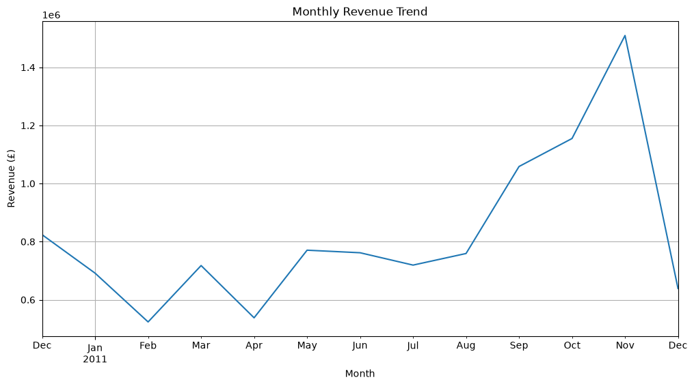
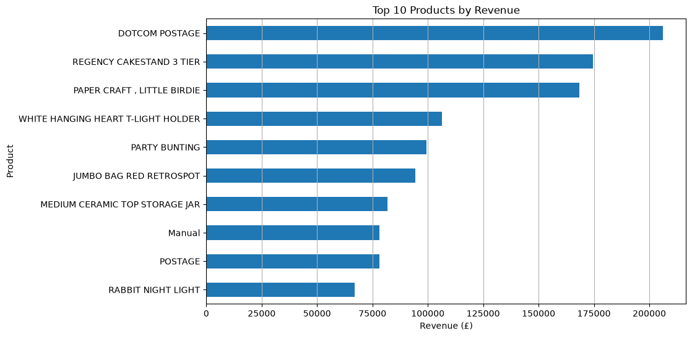
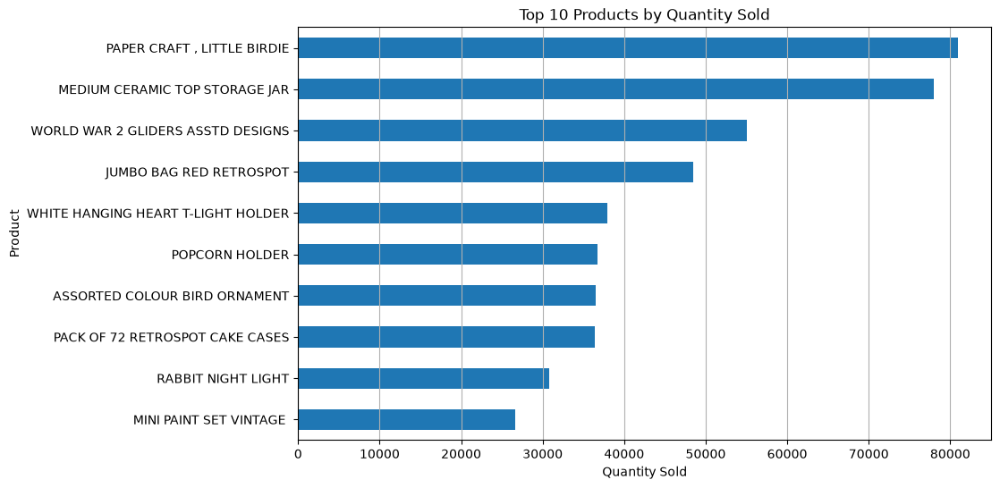
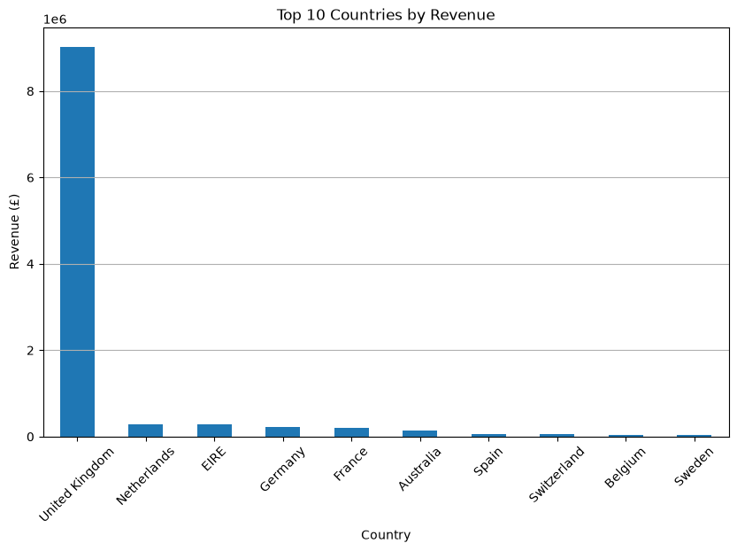
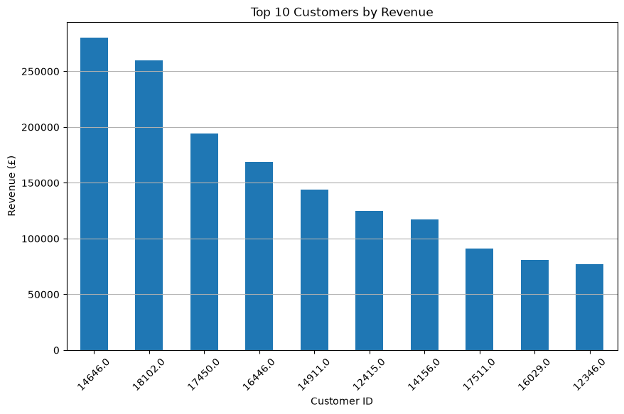
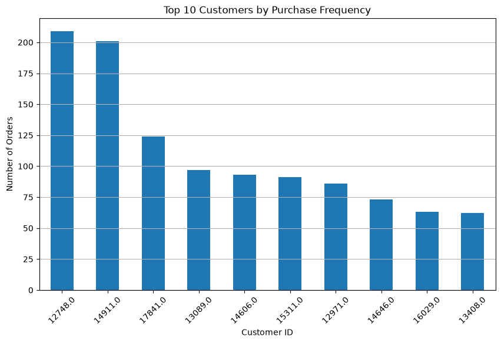
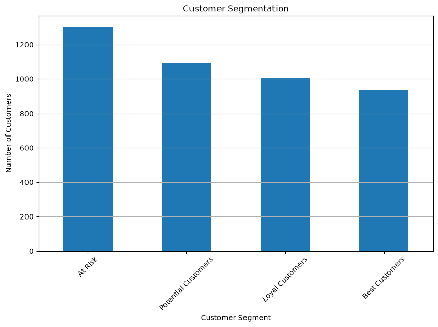

# E-Commerce Sales Analysis

## Project Overview

This project analyzes e-commerce sales data to identify sales trends,
top-performing products, customer purchasing behavior, and geographic
sales patterns. The analysis was performed using Python and pandas,
with visualizations created using matplotlib and seaborn.

## Dataset

- **Dataset:** UCI Online Retail Dataset
- **Time Period:** December 2010 – December 2011
- **Rows:** 541,909
- **Columns:** 8
- **Source:** UCI Machine Learning Repository

## Tools & Technologies

- Python
- Pandas
- NumPy
- Matplotlib
- Seaborn
- Jupyter Notebook
- Excel  

## Data Cleaning & Analysis

### Data Cleaning

- Removed cancelled transactions identified by InvoiceNo starting with "C".
- Removed transactions with negative or zero quantities.
- Removed transactions with zero or negative unit prices.
- Created a Revenue column using Quantity × UnitPrice.
- Converted InvoiceDate into a datetime format for time-based analysis.
- Identified missing CustomerID values and handled them appropriately during customer-level analysis.
- Identified duplicate records for data-quality assessment.

### Exploratory Data Analysis

The project analyzes:

- Monthly revenue trends
- Top-performing products by revenue
- Top products by quantity sold
- Revenue by country
- Top customers by revenue
- Customer purchase frequency
- Average order value
- Customer recency, frequency, and monetary value (RFM)
- Customer segmentation

-Key Business Insights

- The cleaned dataset generated approximately **£10.67 million** in revenue.
- **November 2011** recorded the highest monthly revenue at approximately **£1.51 million**.
- **REGENCY CAKESTAND 3 TIER** was the highest-revenue actual product, generating approximately **£174,485**.
- The **United Kingdom** was the dominant market, contributing approximately **84.6%** of total revenue.
- The analysis identified **4,338 customers** with available CustomerIDs for customer-level analysis.
- RFM analysis divided customers into **Best Customers, Loyal Customers, Potential Customers, and At Risk** segments.
- Customer purchasing behavior varied significantly in terms of recency, frequency, and monetary value.

-
-Business Recommendations

- Focus retention campaigns on Best Customers and Loyal Customers.
- Develop re-engagement campaigns for At Risk customers.
- Promote high-performing products through targeted campaigns and product bundles.
- Investigate high-AOV international markets for potential expansion.
- Monitor monthly revenue trends to identify seasonal demand patterns.

-## Project Visualizations

### Monthly Revenue Trend

### Top Products by Revenue

### Top Products by Quantity

### Top Countries by Revenue

### Top Customers by Revenue

### Top Customers by Purchase Frequency

### Customer Segmentation

